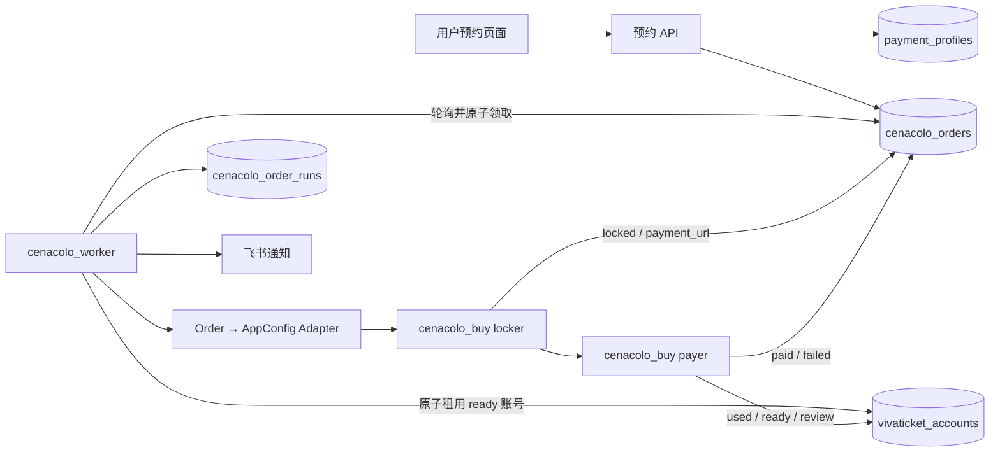
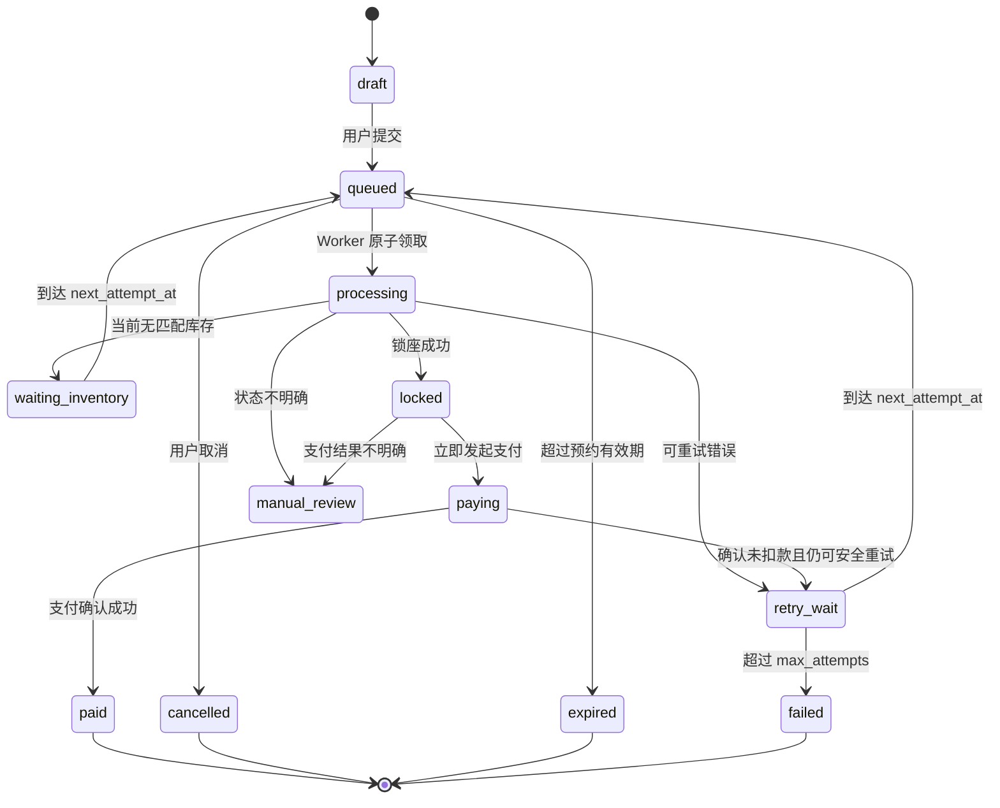

# 最后的晚餐预约驱动抢票系统设计

**日期：** 2026-08-17  
**范围：** 用户预约落库、任务感知、账号分配、锁票支付、结果回写  
**现有项目：** `cenacolo_buy`、`cenacolo_vivaticket`  
**本文只定义设计，不包含代码修改。**

## 1. 结论

最优方案是：

1. 前端预约接口只负责校验用户输入，并将预约写入 Mongo 集合 `cenacolo_orders`。
2. 日本服务器常驻一个 `cenacolo_worker`，每 2～5 秒通过 Mongo HTTP API 查询并原子领取可执行订单。
3. Worker 从 `vivaticket_accounts` 原子租用一个 `ready` 账号。
4. Worker 将订单、账号和运行配置组合成内存中的 `AppConfig`，调用现有 `cenacolo_buy` 锁票和支付流程。
5. 每个关键步骤实时回写订单状态，同时记录独立的执行记录。
6. 支付成功后订单变为 `paid`，账号变为 `used`；失败时根据失败阶段决定账号释放、冷却或转人工复核。

Mongo 是业务状态的唯一真相源。日志、JSON artifacts 和飞书消息只用于诊断及通知，不能代替订单状态。

不建议前端写库后直接启动 Python 进程，也不建议只依赖 Redis 消息。前者难以控制并发和重试，后者存在消息与 Mongo 状态不一致的问题。

## 2. 总体架构



各模块职责：

- **预约 API**：输入校验、幂等创建预约、返回订单号。
- **Mongo HTTP API**：订单与账号状态存储，提供条件更新能力。
- **Worker**：调度、原子领取、租约续期、重试和资源回收。
- **Adapter**：将 Mongo 订单转换为现有 `AppConfig`，不把数据库逻辑侵入 locker/payer。
- **`cenacolo_buy`**：继续只负责 WAF、登录、查库存、锁座、实名填写和支付。
- **账号池**：提供已激活的 Vivaticket 账号，并保证同一时间一个账号只属于一个订单。

## 3. 为什么选择轮询 Worker

当前 Mongo 通过 `https://dingstest.133.cn/mongo_api` 访问，并非应用直连 Mongo，因此不应依赖 Mongo Change Stream。

第一版采用 2～5 秒轮询：

- 部署简单，只需要一个常驻进程。
- Mongo 仍是真相源，Worker 重启后可以恢复任务。
- 不依赖前端服务器能够访问抢票机。
- 可通过条件更新防止两台 Worker 重复执行同一订单。
- 后续如需更低延迟，可以增加 Redis 通知，但 Redis 只负责“唤醒”，Worker 仍需从 Mongo 原子领取订单。

推荐运行方式：

```text
systemd 管理 cenacolo_worker
  └─ 主循环每 2 秒找一条 queued/retry_wait 订单
      └─ 没任务时逐步退避到 5 秒
```

不推荐长期使用 `nohup` 作为正式部署方式。`systemd` 能自动重启、集中日志并限制同时运行的实例数。

## 4. Mongo 集合设计

### 4.1 `cenacolo_orders`

一条文档代表一个用户预约和最终购票结果。

```json
{
  "_id": "order_id",
  "order_no": "CEN202608170001",
  "idempotency_key": "frontend_generated_uuid",
  "user_id": "dings_user_id",
  "contact": {
    "name": "Peng Bin",
    "email": "customer@example.com",
    "phone": "+8613800000000"
  },
  "passengers": [
    {
      "first_name": "Peng",
      "last_name": "Bin"
    }
  ],
  "request": {
    "target_dates": ["2026-09-10", "2026-09-11"],
    "use_any_available": false,
    "ticket_count": 1,
    "priority": 50,
    "not_before": "2026-08-18T01:00:00Z",
    "expires_at": "2026-09-11T23:00:00Z"
  },
  "payment_profile_id": "payment_profile_id",
  "status": "queued",
  "version": 1,
  "attempts": 0,
  "max_attempts": 10,
  "next_attempt_at": "2026-08-18T01:00:00Z",
  "worker": {
    "worker_id": null,
    "lease_token": null,
    "lease_until": null,
    "heartbeat_at": null
  },
  "account": {
    "email": null,
    "lease_token": null
  },
  "result": {
    "job_id": null,
    "date": null,
    "time": null,
    "custref": null,
    "payment_url": null,
    "amount_cents": null,
    "payment_method": null,
    "final_url": null
  },
  "last_error": {
    "code": null,
    "stage": null,
    "message": null,
    "retryable": null,
    "at": null
  },
  "created_at": "2026-08-17T08:00:00Z",
  "updated_at": "2026-08-17T08:00:00Z",
  "paid_at": null,
  "cancelled_at": null
}
```

约束：

- `order_no` 唯一。
- `idempotency_key` 唯一，避免用户重复点击创建两单。
- `ticket_count` 必须等于 `passengers` 数量。
- 日期统一使用 `YYYY-MM-DD`，时间字段统一存 UTC ISO 8601。
- 用户只可修改 `draft` 或 `queued` 状态的预约。
- 一旦进入 `processing`，修改应变成取消旧单并创建新单。

### 4.2 `vivaticket_accounts`

保留现有字段，扩充租约字段和状态：

```json
{
  "email": "account@163.com",
  "password": "generated_password",
  "site": "cenacolovinciano",
  "status": "ready",
  "lease": {
    "order_id": null,
    "worker_id": null,
    "lease_token": null,
    "lease_until": null
  },
  "used_order_id": null,
  "used_at": null,
  "review_reason": null,
  "updated_at": "2026-08-17T08:00:00Z"
}
```

账号状态：

- `ready`：可领取。
- `reserved`：已被某订单租用，但尚未确认消费。
- `used`：购票成功，不再使用。
- `cooldown`：流程产生副作用或锁座后支付失败，暂不自动回池。
- `review`：状态不明确，需要人工确认。
- `failed` / `exists`：注册阶段不可用。

现有 `claim_ready_account()` 只有查询，没有原子状态变更，不适合多 Worker。正式接入前必须改为条件更新：

```text
更新条件：
  email = 指定账号
  status = ready

更新内容：
  status = reserved
  lease.order_id = 当前订单
  lease.lease_token = 随机 token
  lease.lease_until = 当前时间 + 租期

只有 matchedCount = 1 才算领取成功。
```

### 4.3 `cenacolo_order_runs`

一条订单可以尝试多次，因此执行记录应单独存储，不要覆盖在订单文档里。

建议字段：

- `run_id`、`order_id`、`attempt_no`
- `worker_id`、`account_email`
- `started_at`、`finished_at`
- `stage`：`claim` / `waf` / `login` / `inventory` / `lock` / `pay`
- `status`：`running` / `success` / `failed`
- `retryable`
- `error_code`、`error_message`
- `job_snapshot`：不含卡号、CVV 和 Cookie 的 PaymentJob 摘要
- `artifact_paths`

用途：

- 审计每次抢票发生了什么。
- 统计常见失败阶段。
- 判断账号是否应该释放。
- 不让 `cenacolo_orders` 因保存大量历史而持续膨胀。

### 4.4 `payment_profiles`

订单只保存 `payment_profile_id`，不要在 `cenacolo_orders` 中长期保存卡号和 CVV。

最优方案是支付服务商 tokenization，Mongo 只保存 token。如果当前支付通道无法 token 化，过渡方案必须满足：

- PAN 使用服务端密钥加密后存储。
- CVV 只允许短期加密存储，并设置 TTL；一次支付后立即清除。
- 日志、飞书、artifacts 永远不输出 PAN、CVV、Cookie。
- 前端和普通后台接口永远不返回完整卡号或 CVV。
- 解密权限只给日本抢票 Worker。

建议字段：

```json
{
  "_id": "payment_profile_id",
  "user_id": "dings_user_id",
  "pan_ciphertext": "...",
  "expiry_ciphertext": "...",
  "cvv_ciphertext": "...",
  "last4": "1234",
  "holder_first_name": "Peng",
  "holder_last_name": "Bin",
  "billing_email": "customer@example.com",
  "status": "active",
  "cvv_expires_at": "2026-08-18T01:30:00Z",
  "created_at": "2026-08-17T08:00:00Z"
}
```

如果暂时没有加密和密钥管理能力，不应上线用户卡自动支付；可先做到自动锁座并将支付链接交给受控后台处理。

## 5. 订单状态机



关键规则：

- `locked` 后必须同进程立即进入 `paying`，不能重新排队。
- 支付结果不明确时进入 `manual_review`，不能自动换账号再次支付，避免重复扣款。
- “当前无票”不是系统错误，进入 `waiting_inventory`，不应快速消耗 `attempts`。
- WAF、网络和打码暂时失败可以重试，但必须指数退避。
- 用户取消只对 `draft`、`queued`、`waiting_inventory` 生效；`locked` 后只能走人工处理。

## 6. Worker 领取与租约

### 6.1 原子领取订单

由于 Mongo HTTP API 当前没有明确的 `findOneAndUpdate(returnDocument)` 封装，建议采用“查询候选 + 条件更新 + 检查 matchedCount”：

```text
1. 查询一条：
   status in [queued, retry_wait]
   next_attempt_at <= now
   not_before <= now
   expires_at > now
   按 priority DESC, created_at ASC 排序

2. 生成 worker_id 和 lease_token。

3. 条件更新：
   _id = candidate._id
   status = candidate.status
   version = candidate.version

4. 设置：
   status = processing
   version = version + 1
   worker.worker_id
   worker.lease_token
   worker.lease_until = now + 5 分钟
   worker.heartbeat_at = now

5. matchedCount = 1 才领取成功，否则重新查询。
```

租约而不是永久锁的原因：Worker 或服务器崩溃后，Reaper 可以把超时任务恢复。

### 6.2 心跳与恢复

- Worker 每 30 秒续租订单和账号。
- 默认租约 5 分钟。
- `locked` 后租约至少覆盖支付截止时间。
- 独立 Reaper 每分钟扫描：
  - `processing` 且 `lease_until < now`：转 `retry_wait`。
  - `locked/paying` 且租约过期：转 `manual_review`，不能自动重试支付。
  - `reserved` 账号租约过期：根据对应订单状态决定回 `ready` 或进 `review`。

## 7. 账号生命周期

账号释放策略按执行阶段决定：

1. **WAF、登录前失败**：账号可以回 `ready`。
2. **登录成功但未锁座**：清空购物车成功后可以回 `ready`。
3. **锁座成功、支付确定失败且未购票**：进入 `cooldown`，待购物车释放并复核后再回池。
4. **支付成功**：账号改为 `used`，记录 `used_order_id`。
5. **支付结果不明或疑似扣款**：账号改为 `review`，订单改为 `manual_review`。

账号状态变更和订单状态变更无法跨集合事务提交，因此需要可补偿设计：

- 订单始终记录 `account.email` 和 `lease_token`。
- 账号始终记录 `lease.order_id` 和相同 token。
- Reconciler 定期找出不一致关系并修复或报警。

## 8. 从订单构建现有 `AppConfig`

不要让 `locker` 和 `payer` 直接查询 Mongo。增加一个 Adapter 层：

```text
Order document
  + reserved Vivaticket account
  + decrypted payment profile
  + static runtime settings
  ↓
AppConfig
  ↓
run_locker(cfg)
  ↓
pay_job(job, cfg)
```

字段映射：

- `account.email/password` ← `vivaticket_accounts`
- `event.target_dates` ← `order.request.target_dates`
- `event.use_any_available` ← `order.request.use_any_available`
- `event.ticket_count` ← `order.request.ticket_count`
- `passengers` ← `order.passengers`
- `payment.card` ← 临时解密的 `payment_profiles`
- Captcha、代理、飞书、事件 ID、浏览器参数 ← Worker 本地静态配置

建议给 `AppConfig` 增加纯内存构造入口，而不是为每条订单生成临时 YAML 文件。`config.local.yaml` 继续保留给手工调试和单次执行。

## 9. Worker 执行流程

```text
启动
  ├─ 检查 Mongo API、账号池、打码服务和浏览器
  └─ 进入轮询

领取订单
  ├─ 原子 claim order
  ├─ 校验订单字段与有效期
  ├─ 原子 reserve account
  ├─ 读取并临时解密支付资料
  └─ 创建 order_run

执行
  ├─ order.status = processing
  ├─ run_locker(cfg)
  ├─ 锁座后立即回写 locked、custref、deadline_at
  ├─ order.status = paying
  └─ pay_job(job, cfg)

收尾
  ├─ 成功：order=paid，account=used
  ├─ 可安全重试：order=retry_wait，account 按阶段释放
  ├─ 无票：order=waiting_inventory，account=ready
  ├─ 结果不明：order=manual_review，account=review
  └─ 写 order_run、清理内存卡信息、飞书通知
```

## 10. 重试、限流与优先级

### 重试分类

- `NO_INVENTORY`：不算技术失败，30～120 秒后重查；接近放票时间可缩短到 5～10 秒。
- `WAF_BLOCKED`：换新浏览器会话，指数退避。
- `CAPTCHA_FAILED`：短暂重试，限制连续次数。
- `LOGIN_FAILED`：账号进入 `review`，订单换号重试。
- `LOCK_CONFLICT`：立即尝试下一个时段。
- `PAYMENT_DECLINED`：默认不可自动重复，转 `failed` 或人工处理。
- `PAYMENT_UNKNOWN`：必须 `manual_review`，禁止再次扣款。

### 并发

第一阶段建议：

- Worker 进程：1 个。
- 同时处理订单：1 个。
- 账号租约：一单一号。

稳定后可以增加到 2～3 个并发，但必须先完成原子领取、租约、支付幂等和 WAF 限流。直接开启大量并发会增加封禁、重复锁座和重复支付风险。

### 优先级

订单排序建议：

1. `priority` 高的先执行。
2. 相同优先级按 `created_at` 先到先服务。
3. 接近 `expires_at` 的订单可提升优先级。
4. 同一用户短时间内的重复订单只保留一个有效任务。

## 11. 支付幂等与安全

支付是整个系统最危险的部分：

- 以 `order_id + custref` 作为支付幂等键。
- 发起支付前写入 `paying` 和 `custref`。
- Worker 重启后看到 `paying`，先查支付/订单结果，不允许直接再次提交卡。
- 飞书只发送 `order_no`、日期、金额、支付结果和卡后四位。
- artifacts 中移除 Cookie、PAN、CVV 和完整支付 URL 的敏感参数。
- 进程结束前覆盖或删除内存/临时文件中的卡资料。

如果站点没有可靠的支付结果查询接口，任何网络中断后的支付都必须进入 `manual_review`。

## 12. 前端与预约 API 约定

创建预约时：

1. 前端生成 `idempotency_key`。
2. API 校验姓名、人数、日期、联系信息和支付资料。
3. API 创建 `payment_profile`。
4. API 创建状态为 `queued` 的订单。
5. 返回 `order_no`。

用户查询状态时只返回面向用户的简化状态：

- `submitted`：对应内部 `queued/waiting_inventory`。
- `processing`：对应内部 `processing/locked/paying`。
- `success`：对应内部 `paid`。
- `failed`：对应内部 `failed/expired`。
- `cancelled`：对应内部 `cancelled`。

不要把内部账号、WAF、Cookie、打码错误或支付 URL 直接暴露给前端。

## 13. 可观测性与告警

日志必须始终携带：

- `order_id`
- `order_no`
- `run_id`
- `worker_id`
- `account_email`（必要时脱敏）
- `stage`

核心指标：

- queued 数量与最老等待时长
- processing 数量
- ready 账号数量
- 每阶段成功率和耗时
- 无票次数
- 锁座成功率
- 支付成功率
- `manual_review` 数量
- 租约过期与 Worker 重启次数

必须即时飞书告警：

- 锁座成功但支付失败
- 支付结果不明确
- ready 账号不足
- 连续 WAF/验证码失败
- Worker 停止心跳
- 队列积压超过阈值

## 14. 部署建议

在日本服务器 `/root/pengb_dev/cenacolo_buy` 部署：

- `cenacolo-worker.service`：常驻 Worker，`Restart=always`。
- `cenacolo-reaper.service` + timer：恢复过期租约。
- 日志交给 journald，并保留现有本地 artifacts。
- 单机第一版不需要 Redis。
- Worker 启动时必须校验 Mongo HTTP API、浏览器、打码 key 和账号池。

部署时使用独立服务用户，避免以 root 运行浏览器和处理支付资料。

## 15. 分阶段落地

### 第一阶段：订单驱动但不自动支付

- 建 `cenacolo_orders`、`cenacolo_order_runs`。
- Worker 原子领取订单和账号。
- Adapter 构造 `AppConfig`。
- 自动查票、锁座、回写 `payment_url`。
- 验证状态机、租约与恢复机制。

### 第二阶段：接入自动支付

- 建 `payment_profiles` 和密钥管理。
- 支付幂等及 `manual_review`。
- 自动支付结果回写。
- 支付成功后账号标记 `used`。

### 第三阶段：稳定性

- Reaper、Reconciler、指标和告警。
- 按失败类型自动重试。
- 有票监控用于唤醒 Worker。
- 在验证原子性后逐步增加并发。

## 16. 验收标准

设计完成后的系统应满足：

1. 前端重复提交不会产生重复预约。
2. 两个 Worker 不会领取同一订单或同一账号。
3. Worker 崩溃后未锁座订单能够自动恢复。
4. 锁座成功后立即支付，并实时记录 20 分钟截止时间。
5. 支付结果不明确时不会重复扣款。
6. 成功订单为 `paid`，对应账号为 `used`。
7. 未锁座失败的账号可以安全回池。
8. Mongo 中可以还原每次执行历史。
9. 日志和通知中没有卡号、CVV、Cookie 等敏感信息。
10. 账号不足、队列积压、支付异常和 Worker 停止都有告警。

## 17. 最终建议

第一版不要引入 Redis、Kafka、Mongo Change Stream 或多 Worker。先完成：

```text
Mongo queued order
  → 单 Worker 原子领取
  → 原子租用账号
  → Adapter 调用现有 cenacolo_buy
  → 状态回写
  → 账号回收或 used
```

这是当前代码和部署条件下复杂度最低、可靠性最高、最容易审计和恢复的方案。等单 Worker 全流程稳定后，再用 Redis 通知降低轮询延迟，并逐步开放有限并发。
